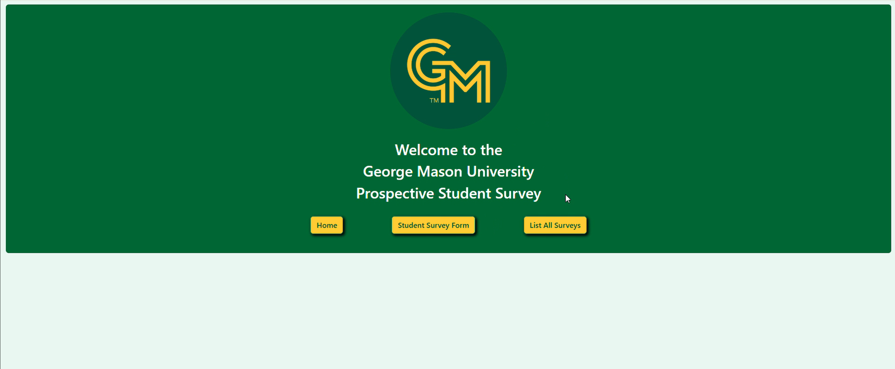
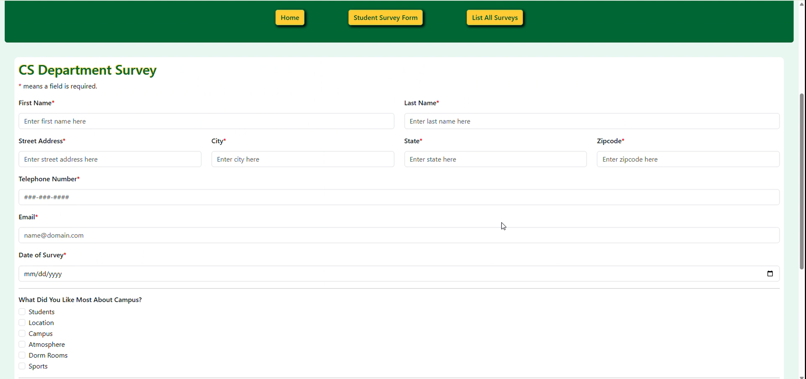
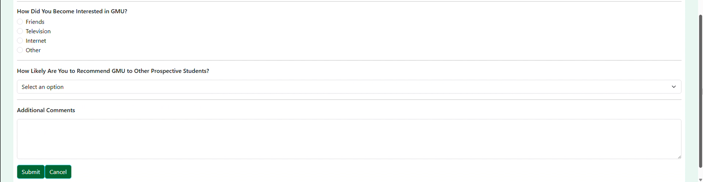
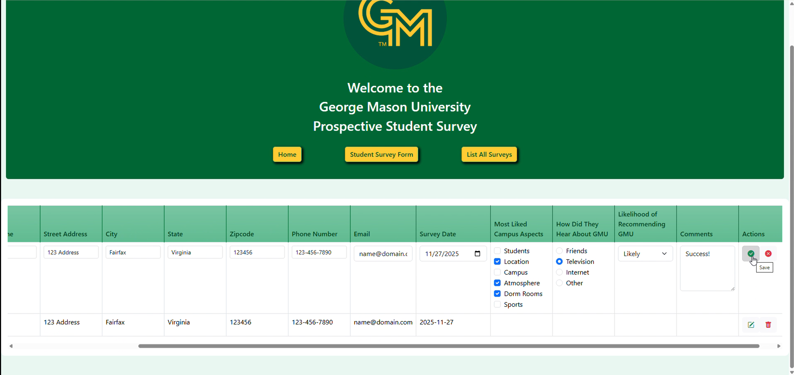

# Prospective Student Survey System
A full-stack application for collecting and managing prospective student survey responses.

## Tech Stack
- Angular
- Spring Boot
- Java
- JPA/Hibernate
- MySQL
- Bootstrap
- REST API

## Features
- Allows users to create, view, update, and delete prospective student surveys
- Validates form responses
- RESTful client-server communication
- Includes MySQL persistence
- Responsive web interface

## Architecture
The application includes an Angular frontend and a Spring Boot backend. 
The backend includes a layered architecture, including a Controller -> Service -> Repository -> Database.
JPA/Hibernate is used for database persistence.

## Project Structure
- `frontend/` - Angular frontend
- `backend/` - Spring Boot backend
- `init.sql` - Database initialization script

## Screenshots

### Homepage

### Survey Form

### Survey List/CRUD

## Running Locally

### Prerequisites
- Java 21
- Node.js
- Angular CLI
- MySQL

### Database
1. Create a database named `survey_db`
2. Run `init.sql`
3. Enter your MySQL credentials in `application.properties`

### Backend
1. Navigate to `backend/`
2. Run the Spring Boot application

### Frontend
1. Navigate to `frontend/`
2. Install dependencies
3. Run the development server
